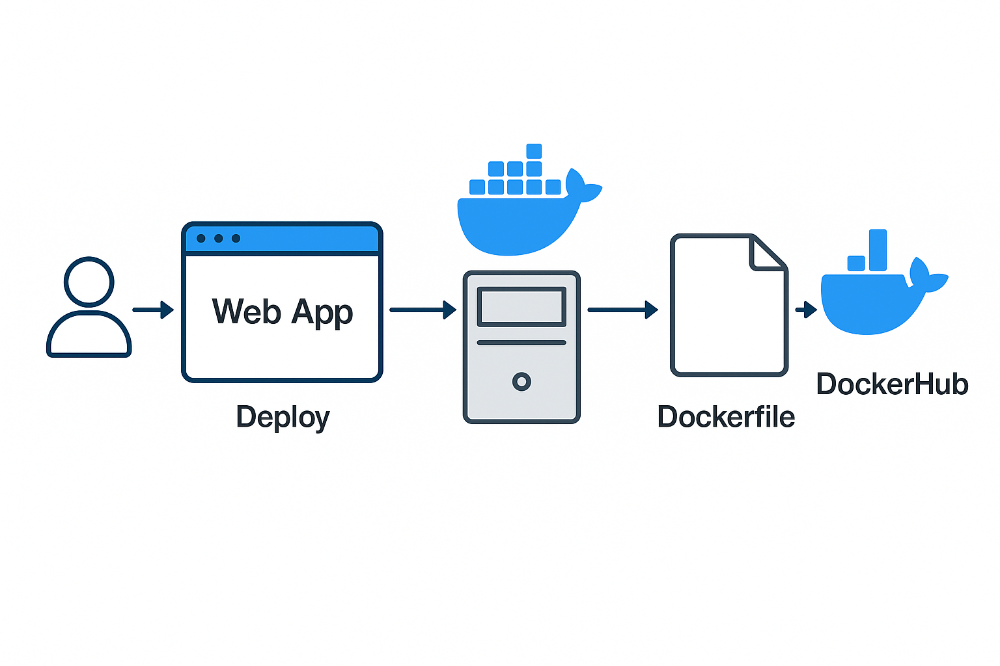

# Dockerize Web App and Push to DockerHub

---

## Project Description

This project demonstrates how to Dockerize a simple Node.js web application and publish it to DockerHub. It serves as a basic introduction to containerization, DevOps workflows, and cloud-native application deployment.

---

## Tech Stack

* **Node.js**: JavaScript runtime to run the web application.
* **Express.js**: Web framework for building HTTP servers.
* **Docker**: Container platform to package the application.
* **DockerHub**: Cloud repository to store and share Docker images.
* **GitHub**: Version control to store source code.

---

## Project Architecture



This diagram illustrates how Docker is used to build, tag, and push the image to DockerHub, and finally run it as a container accessible from the web browser.

---

## Why Docker?

* **Consistency**: Same environment across development, testing, and production.
* **Isolation**: Avoids conflicts with other apps on host machine.
* **Portability**: Runs anywhere Docker is installed.
* **Simplicity**: Easy to manage dependencies.

---

## Prerequisites

* [x] Docker Desktop installed
* [x] Node.js & npm installed
* [x] DockerHub account created

---

## Step-by-Step Guide

### 1. Initialize Node.js App

```bash
mkdir my-docker-app
cd my-docker-app
npm init -y
npm install express
```

### 2. Create Application Code (`index.js`)

```javascript
const express = require('express');
const app = express();
const port = 3000;

app.get('/', (req, res) => {
  res.send('Hello Docker World!');
});

app.listen(port, () => {
  console.log(`App listening at http://localhost:${port}`);
});
```

### 3. Create `Dockerfile`

```dockerfile
# Use official Node.js base image
FROM node:18

# Create app directory inside container
WORKDIR /app

# Copy dependency files first
COPY package*.json ./

# Install dependencies inside container
RUN npm install

# Copy remaining source code
COPY . .

# App will run on port 3000
EXPOSE 3000

# Start app when container runs
CMD ["npm", "start"]
```

### 4. Build Docker Image

```bash
docker build -t my-docker-webapp .
```

### 5. Run Docker Container

```bash
docker run -p 3000:3000 my-docker-webapp
```

Open browser: [http://localhost:3000](http://localhost:3000)

### 6. Tag Image for DockerHub

```bash
docker tag my-docker-webapp your-dockerhub-username/my-docker-webapp
```

### 7. Push Image to DockerHub

```bash
docker login
# Enter DockerHub credentials

docker push your-dockerhub-username/my-docker-webapp
```

Your image will now be available in DockerHub.

---

## Key Learnings

* How Docker build context works.
* How to structure Dockerfile for layered builds.
* Importance of `.dockerignore` (optional) to reduce build context.
* The difference between local image tags and remote repository tags.
* Basic DevOps workflow: Code -> Build -> Tag -> Push -> Deploy.

---

## Credits

Project built by **Rebira Adugna** as part of DevOps learning journey.
